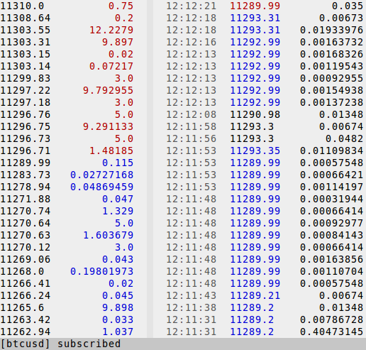

## Terminal based DOM viewer

Quick and simple curses based command line viewer for market data. Shows various data including order book and trades from a single ticker. Populates data from snapshots upon startup and receives updates via subscription.

### Screenshot

#### TODO: write tutorial / instructions
